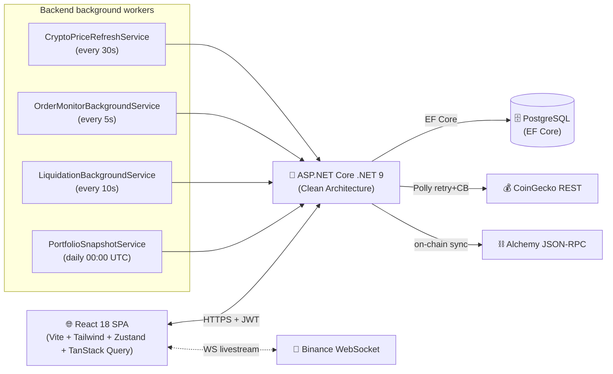

<div align="center">

# 📈 CryptoDash

### Professional crypto portfolio simulator — spot, futures, margin, on-chain.

[](https://dotnet.microsoft.com/)
[](https://react.dev/)
[](https://www.typescriptlang.org/)
[](https://tailwindcss.com/)
[](https://www.postgresql.org/)
[](#)
[](#)

[**🎬 Demo Video**](#) · [**🌐 Live Demo**](#) · [**📖 Architecture**](docs/ARCHITECTURE.md) · [**🚀 Deploy Guide**](DEPLOY.md)


</div>

---

## ✨ What is CryptoDash?

A full-stack **crypto trading simulator** with the depth of a real exchange — but $0 risk. Built to showcase Clean Architecture (.NET 9), real-time WebSocket streaming, and professional-grade infrastructure (rate limiting, observability, idempotency, health checks).

### Why it's interesting

- **Real-time everything** — Binance WebSocket for live prices, depth-of-market, recent trades. CoinGecko for fundamentals.
- **Genuine trading mechanics** — spot transactions, conditional orders (stop-loss / take-profit / limit), **margin positions with leverage and auto-liquidation**.
- **On-chain tracking** — connect MetaMask or paste any EVM address; balances synced via Alchemy across Ethereum / BSC / Polygon / Arbitrum.
- **Production-ready backend** — Polly retry + circuit breaker, FluentValidation, Serilog rolling logs, structured rate limiting, idempotency keys on mutations, health checks, auto EF migrations on startup.
- **Properly tested** — 100 unit tests across services, including `[Theory]`-driven evaluator tests for order trigger logic (zero mocks, pure function).

---

## 🎯 Feature Tour

| | |
|---|---|
| 🏦 **Multi-wallet portfolio** | Create wallets, deposit fiat (max $1M/tx), transfer between wallets atomically, view holdings per-wallet with live P&L. |
| 📊 **Trading terminal** | KLineChart candles + volume, EMA 7/25/99 always-on, toggleable RSI / MACD / BOLL / KDJ. 9 drawing tools. 6 timeframes. |
| 📖 **Order book + depth chart** | Real-time `@depth20@100ms` stream, cumulative bid/ask area chart, recent trades with two-layer deduplication. |
| ⚡ **Conditional orders** | Stop-loss, take-profit, limit. Backend `OrderMonitorBackgroundService` polls every 5s and auto-fills triggered orders. |
| 📈 **Margin positions** | Long/short with 1-100x leverage, collateral deducted on open, **auto-liquidation** monitored every 10s, configurable maintenance margin (5%). |
| 🔗 **On-chain wallets** | MetaMask connect via raw `window.ethereum` (no wagmi dep) + manual address input. ERC-20 balances cached as JSON. |
| 🏆 **Leaderboard** | Weekly / monthly / all-time P&L% rankings. **Public** endpoint. Export top traders as PNG via `html-to-image`. |
| 🔔 **Price alerts** | Browser-side watcher fires toast notifications when live Binance price crosses target. |
| 🌗 **Dark-only design** | Pre-mounted dark mode (no FOUC), yellow accent (Binance signature), mesh gradient hero. |

---

## 🏗️ Architecture at a glance



The backend follows **Clean Architecture** with strict dependency direction:

```
Domain (entities, enums)  ◀── Application (interfaces, DTOs)  ◀── Infrastructure (EF, services)
                                          ▲
                                          └──── Api (controllers, middleware)
```

→ Full diagrams + data flows: [`docs/ARCHITECTURE.md`](docs/ARCHITECTURE.md)

---

## 📸 Screenshots

<div align="center">

| Landing | Markets |
|---|---|
|  |  |

| Trading Terminal | Margin Positions |
|---|---|
|  |  |

| Portfolio | Leaderboard |
|---|---|
|  |  |

</div>

→ More: [`docs/screenshots/`](docs/screenshots/)

---

## 🛠️ Tech Stack

<table>
<tr><td valign="top">

**Frontend**
- React 18 + TypeScript + Vite
- Tailwind CSS (dark-only)
- Zustand (auth + live prices)
- TanStack Query v5 (server state)
- KLineChart + Lightweight Charts + Recharts
- React Router DOM (lazy-loaded routes)
- Axios with auto-refresh interceptor
- React Hook Form + Zod validation

</td><td valign="top">

**Backend**
- ASP.NET Core .NET 9
- Clean Architecture (4 projects)
- EF Core + Npgsql (PostgreSQL)
- JWT + refresh token rotation (SHA-256 hashed)
- Polly (retry, circuit breaker)
- FluentValidation
- Serilog (console + rolling file)
- Rate limiting (5 policies)
- Health checks (DB + price cache)

</td><td valign="top">

**Infra**
- Docker multi-stage builds
- nginx SPA serving
- Render.com Blueprint (`render.yaml`)
- Auto EF migrations on startup
- xUnit + Moq + EF InMemory (100 tests)
- GitHub Actions ready

</td></tr></table>

---

## 🚀 Run Locally

### Prerequisites

- .NET 9 SDK
- Node.js 20+
- PostgreSQL 16 (or Docker)

### Backend

```bash
# 1. Set up database connection
dotnet user-secrets set "ConnectionStrings:MyConnect" "Host=localhost;Database=cryptodash;Username=postgres;Password=postgres" \
  --project CryptoDashboard.Api

# 2. Set JWT secret (min 32 chars)
dotnet user-secrets set "Jwt:SecretKey" "$(openssl rand -base64 48)" \
  --project CryptoDashboard.Api

# 3. Apply migrations + run
dotnet ef database update --startup-project CryptoDashboard.Api --project CryptoDashboard.Infrastructure
dotnet run --project CryptoDashboard.Api
# → https://localhost:7103
```

### Frontend

```bash
cd crypto-frontend
echo "VITE_API_URL=https://localhost:7103" > .env.local
npm install
npm run dev
# → http://localhost:5173
```

### One-command Docker

```bash
cp .env.docker.example .env.docker
# Fill in JWT_SECRET_KEY (min 32 chars)
docker compose --env-file .env.docker up --build
# → http://localhost:5173 (frontend) · http://localhost:8080 (api)
```

---

## 🧪 Tests

```bash
dotnet test
# Passed!  - Failed: 0, Passed: 100, Skipped: 0
```

| Suite | Coverage |
|---|---|
| `AuthServiceTests` | Login, register, JWT, refresh token rotation |
| `WalletServiceTests` | Deposit, transfer, holdings calc |
| `TransactionServiceTests` | Buy/sell balance integrity, soft-delete reversal |
| `PortfolioServiceTests` | Snapshot idempotency, history forward-fill |
| `WatchlistServiceTests` | Add/sync/soft-delete |
| `PriceAlertServiceTests` | CRUD + ownership |
| `OrderServiceTests` | CRUD + cross-user isolation |
| `OrderTriggerEvaluatorTests` | **18 [Theory] tests** — pure function, all 6 type×side combos |
| `PositionServiceTests` | Liquidation math, PnL, collateral, ownership |

---

## 📦 Project Structure

```
CryptoDash/
├── CryptoDashboard.Domain/         Entities, enums (no dependencies)
├── CryptoDashboard.Application/    Interfaces, DTOs, Options, Validators
├── CryptoDashboard.Infrastructure/ EF Core, services, background workers, health checks
├── CryptoDashboard.Api/            Controllers, middleware, Program.cs
├── CryptoDashboard.Tests/          xUnit + EF InMemory (100 tests)
├── crypto-frontend/                React 18 + Vite SPA (19 pages, lazy-loaded)
├── docs/                           Architecture diagrams, screenshots
├── docker-compose.yml              postgres + api + frontend
└── render.yaml                     Render.com Blueprint
```

→ Detailed architecture: [`docs/ARCHITECTURE.md`](docs/ARCHITECTURE.md)
→ Deploy checklist: [`DEPLOY-CHECKLIST.md`](DEPLOY-CHECKLIST.md)

---

## ✅ Production-grade highlights

These are easy to miss in a demo — but they're what take a project from "works on my machine" to "ready to ship":

- **🔒 Rate limiting** — 5 different policies (`crypto`, `leaderboard`, `auth-login` 5/min, `auth-register` 3/min, `errors` 20/min)
- **🔁 Idempotency keys** — `Idempotency-Key` header on `POST /order` and `POST /position` prevents double-click duplicates (5-min TTL)
- **💚 Health checks** — `/health/live` (liveness) + `/health/ready` (Postgres reachable **and** price cache warm)
- **📝 Telemetry sink** — frontend `ErrorBoundary` ships uncaught exceptions to `POST /api/telemetry/errors` → Serilog Warning
- **🎯 Soft delete** intercepted in `SaveChangesAsync` with global query filters on `Wallet`, `Transaction`, `WatchlistItem`
- **⚡ Polly resilience** on CoinGecko HTTP — retry with exponential backoff + jitter, circuit breaker (5 failures → 30s break)
- **📊 Two-tier caching** — singleton `MemoryCryptoPriceCache` + batch fetcher; refresh worker pre-warms on cold start
- **🏷️ SEO ready** — OG image (1200×630 SVG), Twitter Card, canonical, robots.txt, sitemap.xml, dynamic page titles via `useDocumentTitle` hook
- **🌅 Pre-mount dark mode** — inline script in `index.html` adds `dark` class before React hydrates (zero FOUC)

---

## 🗺️ Roadmap

- [x] **v1**: Auth + wallets + transactions + portfolio + watchlist + alerts
- [x] **v2**: Code splitting, ErrorBoundary, 404 page, Vietnamese auth pages
- [x] **v3**: Conditional orders + margin positions + on-chain wallets + leaderboard
- [x] **v4**: Production-grade infra (Serilog, rate limit, health checks, Docker, Render)
- [x] **v5**: Binance-style Markets + Exchange-style Landing + idempotency + telemetry + SEO
- [ ] **v6 (ideas)**: SignalR realtime orders · email verification · 2FA TOTP · PWA · referral program

---

## 📜 Disclaimer

This is a **simulated trading platform built for learning purposes**. It does not connect to any real exchange, holds no real money, and is not investment advice. Price data is sourced from CoinGecko and Binance public APIs.

---

## 📄 License

MIT — see [LICENSE](LICENSE).

<div align="center">

**Built with ☕ by [@Viluoicode](https://github.com/Viluoicode)** · Star ⭐ the repo if you found this useful!

</div>
