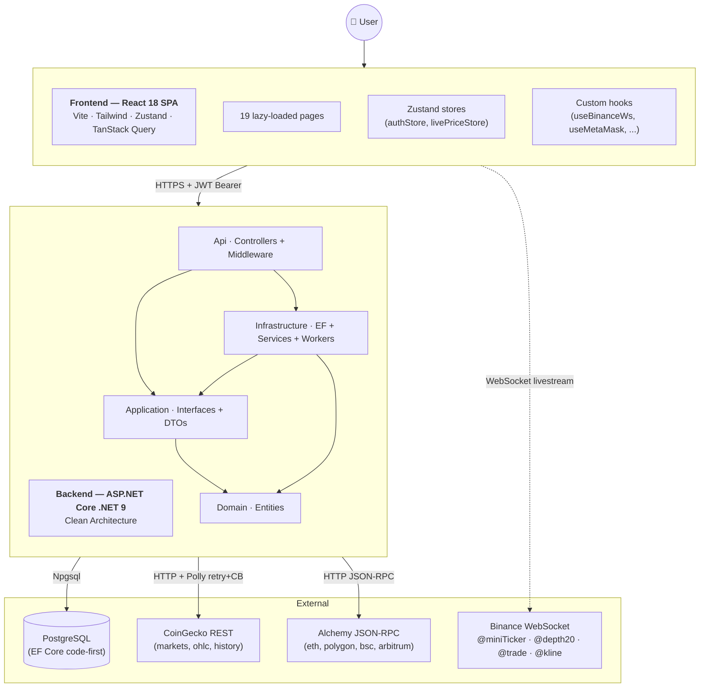
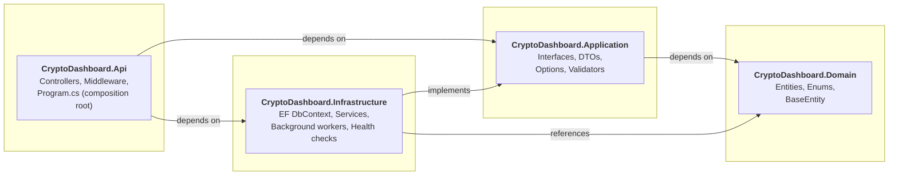
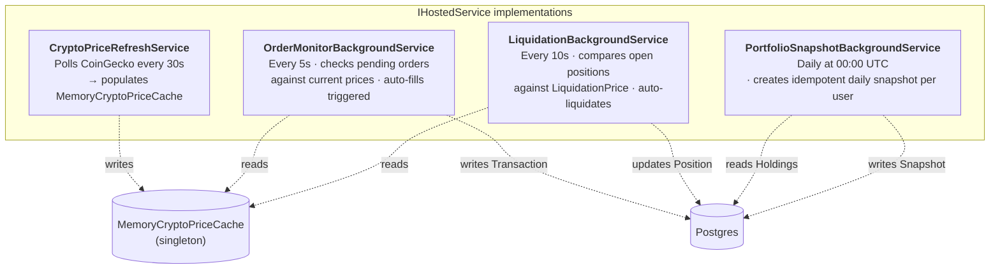
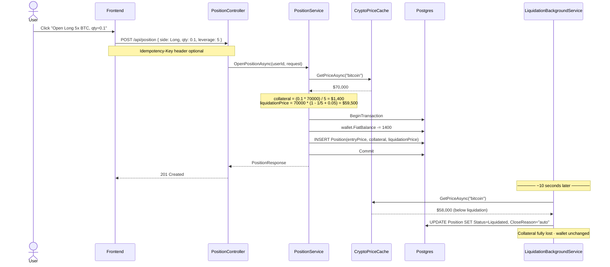
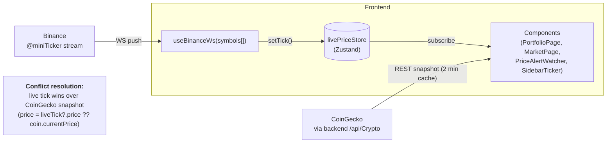
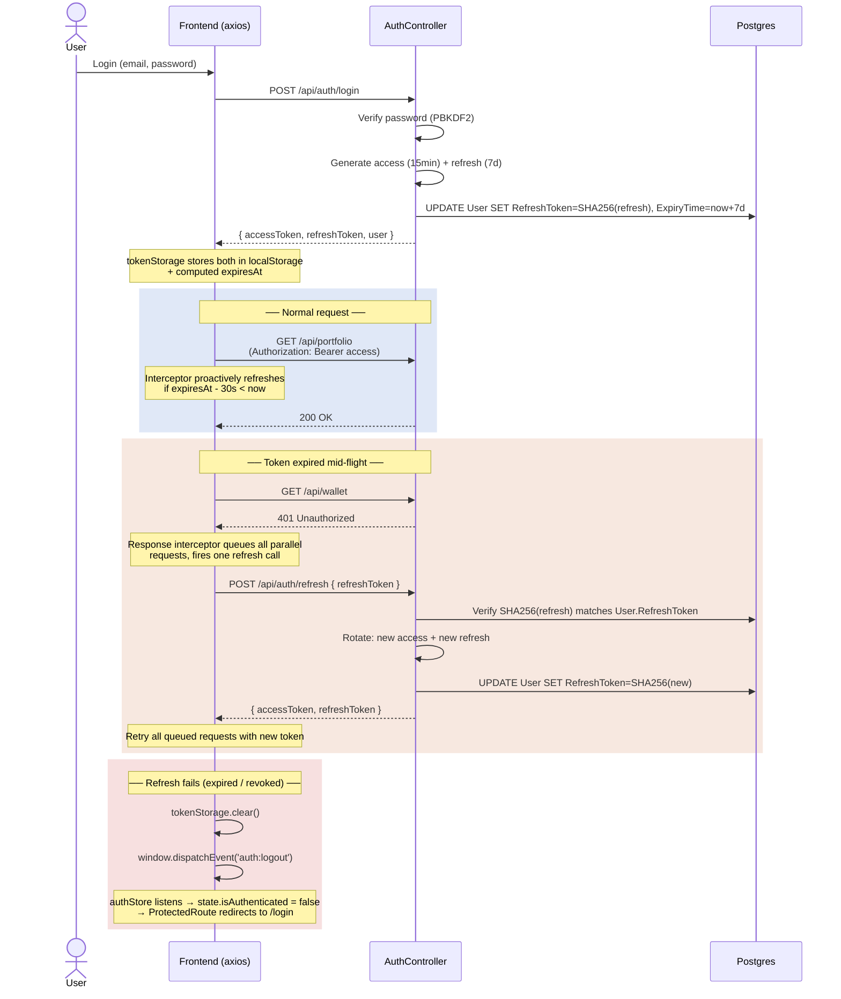

# Architecture

This document describes how CryptoDash is structured — Clean Architecture on the backend, layered React app on the frontend, and the data flows that connect them to upstream APIs (Binance, CoinGecko, Alchemy).

---

## 1. System overview

---

## 2. Clean Architecture layers

**Dependency rule**: dependencies point **inward** toward Domain. Domain knows nothing about EF, ASP.NET, or HTTP. The Application layer defines interfaces (`IWalletService`, `ICryptoService`, `IIdempotencyService`, ...); Infrastructure provides implementations.

| Layer | Dependencies | What lives here |
|---|---|---|
| **Domain** | _none_ | Entities (`User`, `Wallet`, `Transaction`, `Position`, ...), enums, `BaseEntity` |
| **Application** | Domain | Service interfaces, DTOs (request/response shapes), `Options` (config POCOs), FluentValidation validators |
| **Infrastructure** | Domain, Application | `ApplicationDbContext` (EF), service impls, 4 background workers, `MemoryCryptoPriceCache`, health checks, `TokenHasher` |
| **Api** | All three | Controllers, `GlobalExceptionHandlerMiddleware`, JWT setup, CORS, rate limit policies, Swagger, Serilog wiring |

---

## 3. Backend background workers

Four hosted services run independently, each creating its own DI scope per iteration:

**Why `IServiceScopeFactory`?** Background services are singletons; EF `DbContext` is scoped. Each iteration creates a fresh scope so the DbContext is correctly disposed and connections are returned to the pool.

---

## 4. Margin trading flow

Opening a position deducts collateral up front; closing returns `max(0, collateral + PnL)`. Liquidation is monitored continuously.

**Formulas** (in `PositionService`):
- `MaintenanceMarginRate = 0.05` (5%)
- `collateral = entryPrice * quantity / leverage`
- `liquidationPrice (long)  = entryPrice * (1 - 1/leverage + maintenanceMarginRate)`
- `liquidationPrice (short) = entryPrice * (1 + 1/leverage - maintenanceMarginRate)`
- On close: `pnl = (exitPrice - entryPrice) * quantity * sideSign`
- Returned to wallet on close: `max(0, collateral + pnl)`

---

## 5. Real-time price flow

The frontend reads from a **two-tier source**:

**WebSocket discipline**:
- Exponential backoff reconnect: 1s → 2s → 4s → ... → 30s max
- Single shared connection per symbol set
- Frontend writes to Zustand store; components subscribe granularly to avoid re-render storms
- Trade-ID deduplication uses `data.t` (sequential trade ID, `number`), **never** `data.T` (timestamp, can collide)

---

## 6. Auth + refresh-token rotation

**Security details**:
- Access token: HS256, 15 minutes, `ClockSkew = TimeSpan.Zero` (expires exactly at `exp`)
- Refresh token: random 64-byte base64, 7 days, **stored hashed** (SHA-256) — original returned to client only once
- `ChangePasswordAsync` nullifies refresh token → forces re-login on all devices
- Rate limit on `/auth/login` (5/min/IP) and `/auth/register` (3/min/IP)

---

## 7. Frontend bundle splitting

Vite `manualChunks` config in `vite.config.ts` splits the bundle so charting libs (which are large) only load on the page that uses them:

| Chunk | Loaded on |
|---|---|
| `index` (main) | always — 9 KB gzip |
| `vendor-react` | always — 44 KB gzip |
| `vendor-query` | always — 13 KB gzip |
| `vendor-router` | always — 8 KB gzip |
| `vendor-klinecharts` | `/trade` only — 53 KB gzip |
| `vendor-lightweight` | `/market/:coinId` only — 53 KB gzip |
| `vendor-charts` (Recharts) | dashboard/portfolio only — 76 KB gzip |
| `vendor-forms` | login/register only — 22 KB gzip |

**First paint (landing page)**: ~74 KB gzip total.

---

## 8. Soft delete pattern

Entities inheriting `BaseEntity` (`Wallet`, `Transaction`, `WatchlistItem`) are soft-deleted:

1. `ApplicationDbContext.SaveChangesAsync` overrides intercept `EntityState.Deleted` → switch to `Modified`, set `IsDeleted=true`, `DeletedAt=now`.
2. Global query filter `HasQueryFilter(e => !e.IsDeleted)` automatically excludes soft-deleted rows from every query.
3. Tests can opt out with `.IgnoreQueryFilters()` to verify the row is actually flagged.

Entities **without** `BaseEntity` (`PriceAlert`, `TradeOrder`, `Position`, `OnChainWallet`) are hard-deleted — by design, since orders/positions need to preserve history once closed.

---

## 9. Where to look in the code

| Concern | File |
|---|---|
| Composition root | `CryptoDashboard.Api/Program.cs` |
| Auth flow | `Infrastructure/Services/AuthService.cs` + `Api/Controllers/AuthController.cs` |
| Order trigger logic (pure, easy to test) | `Infrastructure/Services/OrderTriggerEvaluator.cs` |
| Margin math | `Infrastructure/Services/PositionService.cs` (`OpenPositionAsync`, `ClosePositionAsync`) |
| Soft-delete interceptor | `Infrastructure/Persistence/ApplicationDbContext.cs` (`SaveChangesAsync`) |
| WebSocket hook | `crypto-frontend/src/hooks/useBinanceWs.ts` + `useBinanceStream.ts` |
| Trading terminal | `crypto-frontend/src/pages/FuturesPage.tsx` |
| Live price store | `crypto-frontend/src/store/livePriceStore.ts` |
